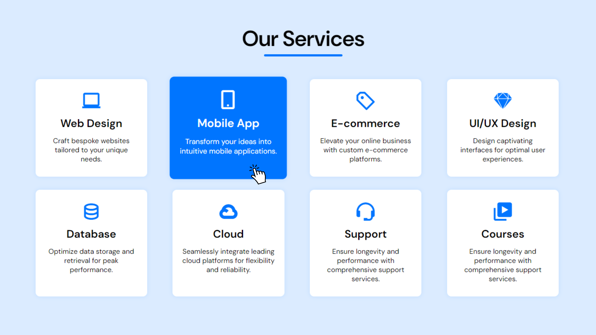

# Responsive Service Section

## Description
This project is a responsive service section designed using HTML, CSS. It showcases various services along with their descriptions.

## Features
- Responsive Design: Ensures optimal viewing experience across different devices.
- Hover Effect: Visually appealing hover effect for service items.
- Customizable: Easily customize service titles and descriptions.
- Grid Layout: Utilizes CSS Grid for a flexible and responsive layout.
- Icon Integration: Integrates Boxicons for service icons.

## Usage
- Explore various services by clicking on each service item.
- Customize service titles and descriptions to match your project requirements.

## Support
For support or inquiries, please contact me via:
- Email: inquery.saurav@gmail.com
- LinkedIn: [Saurav Chaturvedi](https://www.linkedin.com/in/isaurav/)

## Preview

